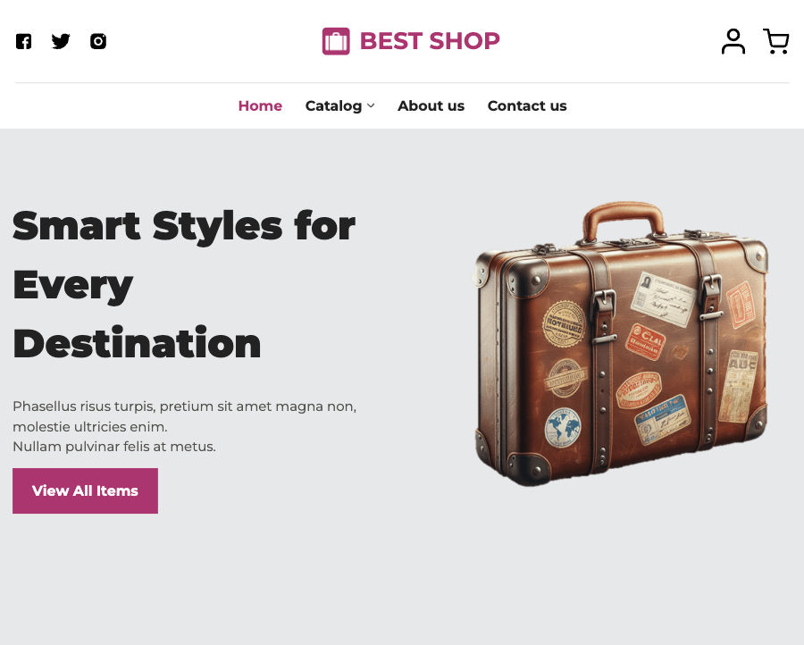

# Project Template

A multi-page responsive e-commerce website built with **HTML**, **SASS**, and **JavaScript**.

---

## Live Demo

🔗 https://suitcases-shop.netlify.app/

## Preview



---

## Tech Stack

- HTML5
- SASS (SCSS)
- JavaScript (ES6+)

---

## Features

- Responsive layout (mobile / tablet / desktop)
- Product listing
- Product details page
- Shopping cart logic
- Form validation

---

## Prerequisites

- Node.js (v18+ recommended)
- npm (comes with Node.js)

---

## ⚙️ Setup & Run

### 1️⃣ Install dependencies

```bash
npm install
```

### 2️⃣ Start the project

```bash
npm run dev
```

This command:

- Compiles SASS into `src/dist/main.css`
- Watches for file changes
- Launches a local server at **http://localhost:3000/**

---

All development happens inside the **src/** folder.
